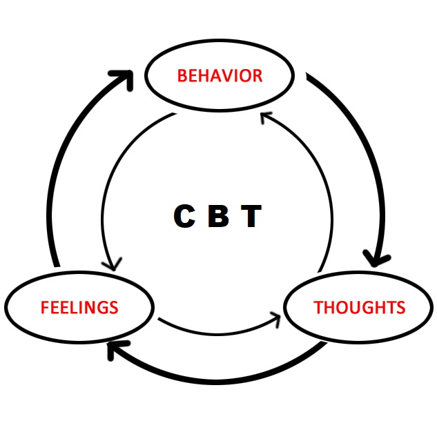

    
Hi! I am a professor of psychology and I am learning how to make websites. This website is a practice attempt at making a website to explain "thought challenging" to people. 

"Thought challenging" is a skill to help improve your mood. It is a part of "cognitive-behavioral therapy (CBT)." You don't need to know all those words in CBT (but learn more here)! The basic idea is to help change your mood by changing how you think.

{width=500px length=500px}

