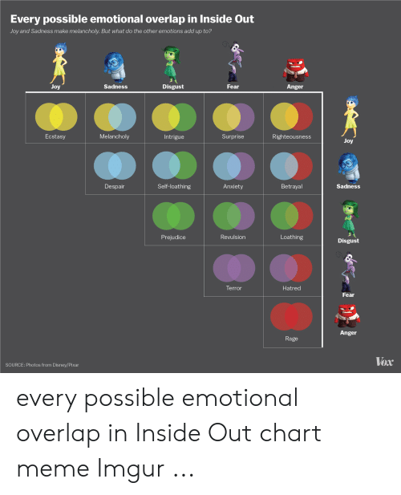

 
According to scientists, feelings or emotions can be grouped roughly in 6 categories. They are:

- sadness
- fear
- anger
- disgust
- surprise
- joy

If you have young children or are a fan of Disney movies you may know these from the movie Inside Out. The reason for that is that Pixar consulted with emotion researchers to base the movie on science. (The feeling "surprise" isn't included because there were already too many characters in the movie. You can read about the science behind Inside Out and why surprise was removed here)

<h2 style="color:#990000">**My emotional life is more complex than 6 emotions**</h2>

You may be thinking that 6 emotions alone cannot describe how complicated feelings can be. If you are, please keep reading because you are right. It's way more complicated than saying there are six feelings. Feelings vary in how *intense* they are. For example, you can think of *irritability* as *anger* that is not very intense and you can think of *hatred* or *rage* as *anger* that is more intense. 

You can also feel combinations of them. For example, some people who remember loved ones who have died feel a mix of sadness and joy that is sometimes called "melancholia." Some people who are afraid (*fear*) of animals like snakes or spiders feel *disgust* at the same time as fear. 
For example, this Vox article drew the possible emotional combinations. 

{width=350px length=350px}

If you add "surprise" to the mix and consider that emotions vary in how strong they are, that paints a much more complicated picture than just saying "there are 6 emotions." 

<h2 style="color:#990000">**Why does this matter**</h2>

One of the reasons it is important to know what you are feeling is because *saying* what you are feeling can actually make you feel better. This is called [affect labeling](https://journals.sagepub.com/doi/pdf/10.1177/1754073917742706) which is not a term you need to know. (It is really just a fancy way of saying that someone said how they were feeling.) So, saying "I am anxious" can make that anxiety a little bit lower than if you were feeling anxious but did not say it. This has been now found in multiple studies. 

Now, we are *not* saying that putting words to your emotions will make the negative ones go away. It will only help reduce the strenght. The real reason we think it is important to put emotions into words is because different emotions are associated to different thoughts.